# 01 · Process Topology — what runs inside `folkbot serve`

Treat `folkbot serve` as a container. The diagram below shows the tokio tasks, child processes, and shared state alive in this process after startup.

```mermaid
flowchart TB
    classDef entry fill:#fef3c7,stroke:#92400e,color:#000
    classDef channel fill:#dbeafe,stroke:#1e40af,color:#000
    classDef bg fill:#fed7aa,stroke:#9a3412,color:#000
    classDef tool fill:#fce7f3,stroke:#9f1239,color:#000
    classDef storage fill:#dcfce7,stroke:#166534,color:#000
    classDef external fill:#e5e7eb,stroke:#374151,color:#000

    subgraph Process["folkbot serve (single OS process · multi-threaded tokio runtime)"]
        direction TB

        Main["MAIN TASK<br/>main() → bootstrap → wait for Ctrl+C"]:::entry

        subgraph Shared["Shared state · Arc'd, lives until shutdown"]
            direction LR
            Pool[("SqlitePool<br/>max 4 conns · WAL")]:::storage
            Core["AgentCore<br/>{pool, llm, registry, base_prompt, outbound}"]:::entry
            BasePrompt["base_prompt:<br/>Arc&lt;RwLock&lt;String&gt;&gt;"]:::entry
            Outbound["outbound:<br/>Arc&lt;HashMap&lt;String, dyn OutboundChannel&gt;&gt;"]:::entry
            SoulCache["SOUL_TRIGGER_CACHE<br/>OnceCell&lt;Mutex&lt;Option&lt;...&gt;&gt;&gt;<br/>(5s TTL · in telegram.rs)"]:::tool
            SendLog["SendMessage.sent_log<br/>Mutex&lt;HashMap&lt;user_id, VecDeque&lt;ts&gt;&gt;&gt;<br/>(rate limit 10/min/asker)"]:::tool
        end

        subgraph BG["Background tokio tasks"]
            direction TB
            Bg["background::spawn<br/>tick every 1800s:<br/>foreach user → vibe / daily / cascade"]:::bg
            Watcher["watcher::spawn<br/>poll folkbot.toml mtime every 5s<br/>on change → re-parse + write base_prompt"]:::bg
        end

        subgraph TG["Telegram channel adapter"]
            direction TB
            TgPoll["teloxide::repl<br/>long-poll getUpdates"]:::channel
            TgHandler["per-update tokio::spawn(handle_message)<br/>(many can run concurrently)"]:::channel
            Editor["editor task<br/>drain mpsc → bot.edit_message_text<br/>(≥900ms gap, 429 backoff)"]:::channel
            TgOutbound["TelegramOutbound<br/>(send_to_principal / send_to_room)"]:::channel
        end

        subgraph MCPGroup["MCP per-server task pairs (1 child per [[mcp.servers]])"]
            direction TB
            McpWriter["writer task<br/>drain mpsc → child.stdin + \\n"]:::tool
            McpReader["reader task<br/>BufReader.lines() → JSON-RPC parse<br/>→ pending HashMap.remove(id).send(v)"]:::tool
            McpPending[("pending<br/>Arc&lt;Mutex&lt;HashMap&lt;u64, oneshot::Sender&gt;&gt;&gt;")]:::tool
        end

        Main --> Shared
        Main --> BG
        Main --> TG
        Main --> MCPGroup

        TgPoll --> TgHandler
        TgHandler -->|sink: TurnEvent::Text| Editor
        TgHandler -->|run_turn| Core
        Core --> Pool
        Core --> BasePrompt
        Core --> Outbound
        Outbound --> TgOutbound
        TgHandler --> SoulCache
        Core -->|via SendMessage tool| SendLog

        Bg --> Pool
        Watcher --> BasePrompt

        McpWriter --> McpPending
        McpReader --> McpPending
        Core -.->|tool dispatch| McpWriter
    end

    subgraph Children["Child processes · kill_on_drop"]
        direction TB
        Fetch[("uvx mcp-server-fetch<br/>Python · ~30MB RSS")]:::external
        FS[("npx server-filesystem<br/>Node · sandboxed to ./workspace")]:::external
    end

    subgraph Externals["External"]
        direction TB
        Telegram(("Telegram<br/>Bot API")):::external
        LLMAPI(("OpenAI-compat HTTP<br/>Poe / OpenAI / vLLM ...")):::external
        ConfigFile[/"folkbot.toml"/]:::external
        DBFile[/"data/folkbot.db (+ -wal, -shm)"/]:::storage
    end

    TgPoll <-->|long-polling| Telegram
    TgOutbound -->|sendMessage| Telegram
    Core -->|stream chat completions| LLMAPI

    McpWriter -->|stdin newline-delim JSON| Fetch
    Fetch -->|stdout newline-delim JSON| McpReader
    McpWriter -->|stdin newline-delim JSON| FS
    FS -->|stdout newline-delim JSON| McpReader

    Watcher -.->|mtime poll| ConfigFile
    Pool <-->|sqlx| DBFile
```

---

## Highlights

### Lifetime
- **MAIN TASK** blocks on `tokio::signal::ctrl_c().await`. After Ctrl+C, abort in order: bg → watcher → channels → drop → child processes auto-killed (`kill_on_drop = true`).
- **BG TASK** first tick fires immediately but is consumed by `tick.tick().await` (to avoid races); after that, once every `interval_seconds` (default 1800).
- **WATCHER** polls `folkbot.toml` mtime every 5s; only hot-reloads `[agent.system_prompt]`; other changes need a restart.
- **MCP child** is held by a `Mutex<Child>`; when `AgentCore` drops, the whole `ToolRegistry` drops, the child handle drops, and `kill_on_drop` triggers SIGKILL.

### Concurrency model
- **Single SqlitePool** shared by all tasks, max 4 connections. WAL mode lets readers not block writers.
- **AgentCore is an Arc**; each telegram update clones an Arc — no extra lock.
- **base_prompt is a RwLock**: watcher writes occasionally, each turn reads (cheap).
- **SendMessage holds an internal Mutex<HashMap>** for rate limiting — writes are short, no contention.
- **MCP pending HashMap** uses `tokio::sync::Mutex` to sync across reader/writer tasks.

### What CLI vs Serve share
| Component | `folkbot chat` | `folkbot serve` |
|---|:---:|:---:|
| `bootstrap()` | ✅ | ✅ |
| `AgentCore` | ✅ | ✅ |
| `background::spawn` | ✅ | ✅ |
| `watcher::spawn` | ✅ | ✅ |
| Telegram inbound | ❌ | ✅ |
| Telegram outbound | ✅ (send_message only) | ✅ |
| rustyline REPL | ✅ | ❌ |
| Channel config required at startup | ❌ | ✅ (bails if no channel) |

---

## Why this shape

- **channel adapter is extracted**: adding Discord / LINE later only requires implementing `OutboundChannel` + an inbound spawn function, without touching AgentCore.
- **MCP child uses stdio, not sockets**: cross-OS simple, `kill_on_drop` cleans up automatically. Cost: serializes all requests (one mpsc). For household-scale traffic this is fine.
- **bg compressor and watcher both poll, not event-driven**: one less dependency (no inotify / fsnotify), consistent across mac/linux/wsl.
