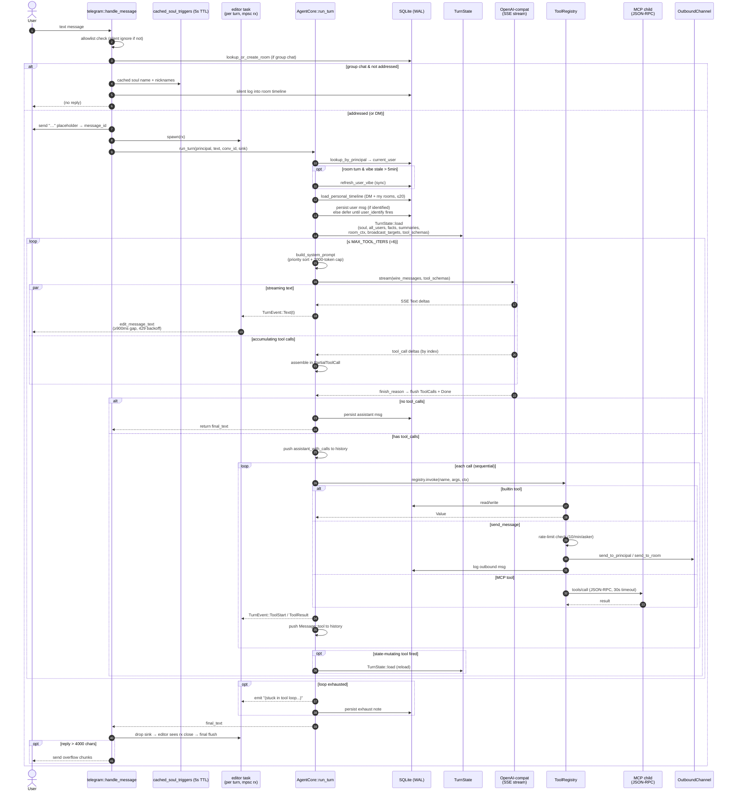
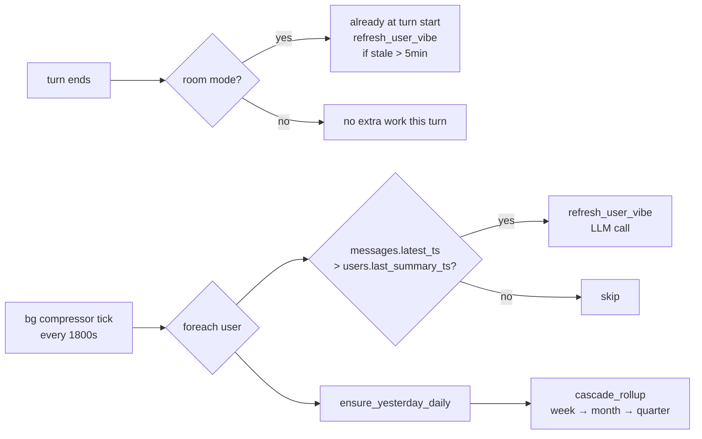

# 02 · Single-Turn Lifecycle — one message in to Folkbot's reply

The full flow from a user typing to Folkbot finishing its reply. The Telegram path is more complex than CLI (streaming edits, room logic), so it's the example here; CLI is a subset.

## High-level sequence



---

## State changes within a turn

```mermaid
stateDiagram-v2
    [*] --> Inbound: telegram update arrives
    Inbound --> Filtered: not on allowlist
    Filtered --> [*]: silent

    Inbound --> Logged: group · not addressed
    Logged --> [*]: silent log to room timeline

    Inbound --> TurnStart: addressed or DM
    TurnStart --> ResolvingUser: lookup_by_principal

    ResolvingUser --> KnownUser: principal in DB
    ResolvingUser --> Anonymous: no mapping

    KnownUser --> StateLoaded
    Anonymous --> StateLoaded: user_facts uses shared (user_id=0)

    StateLoaded --> LLMStreaming: wire built · POST /v1/chat/completions

    LLMStreaming --> TextOnly: finish_reason=stop · no tool_calls
    LLMStreaming --> WithTools: finish_reason=tool_calls

    TextOnly --> Persisted: append to messages
    Persisted --> [*]

    WithTools --> ToolDispatch
    ToolDispatch --> StateDirty: user_identify | soul_patch | fact_remember | fact_forget
    ToolDispatch --> StateLoaded: side-effect-only (MCP, send_message, cross_user_transcript)

    StateDirty --> StateLoaded: TurnState::load again

    note right of WithTools
        Looped up to MAX_TOOL_ITERS=6.
        Hard ceiling: surface
        "stuck in tool loop"
        and persist as a real msg.
    end note
```

---

## Background behavior (doesn't block the main reply)



---

## Where each key step lives

| Step | file:line |
|---|---|
| Telegram inbound dispatch | `src/channels/telegram.rs` `handle_message` |
| Addressing gate | `src/channels/telegram.rs` `is_addressed_to_bot` |
| AgentCore turn driver | `src/agent.rs` `run_turn` |
| Personal timeline fetch | `src/messages.rs` `load_personal_timeline` |
| TurnState one-shot load | `src/agent.rs` `TurnState::load` |
| System prompt assembly | `src/agent.rs` `build_system_prompt` |
| LLM SSE parser | `src/llm/openai.rs` `parse_sse` |
| Tool dispatch | `src/tool/mod.rs` `ToolRegistry::invoke` |
| MCP RPC | `src/mcp/mod.rs` `McpClient::call_tool` |
| Streaming edit (Telegram) | `src/channels/telegram.rs` `stream_to_message` |

---

## Why this shape

- **placeholder + edit** instead of "assemble whole reply then send": looks smooth in UX and avoids hand-managing Telegram chunk-by-message — one message_id suffices, only the overflow case sends extra.
- **mpsc + editor task**: `run_turn` uses a sync sink (`&mut FnMut`), but Telegram I/O is async. The channel decouples the two ends.
- **`add_member` fires at the start of a turn**: rooms have "first-speak join" semantics — if you never typed, you're not a member (a privacy feature).
- **MAX_TOOL_ITERS = 6**: empirical. Most turns have 0 or 1 tool calls; occasionally user_identify→fact_remember→reply uses 3. 6 accommodates multi-step fetch + processing without infinite loops.
- **state_dirty flag**: turns the 4-query `TurnState::load` from "run every iter" into "only run after a state-mutating tool", saving 75% of queries in multi-round scenarios like send_message / fetch / cross_user_transcript.
