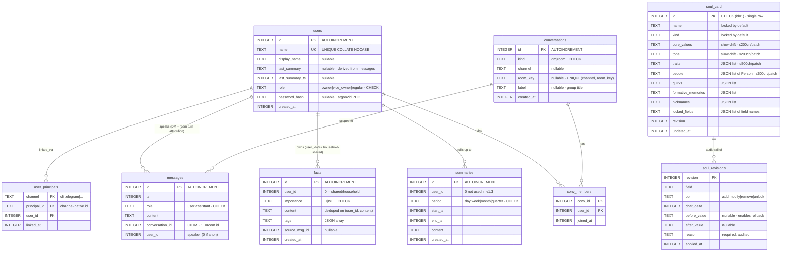

# 03 · Data Schema — SQLite tables + relations + indexes

PRAGMAs: `journal_mode = WAL`, `synchronous = NORMAL`. SQLite 3.51+ recommended (DROP COLUMN is used).

## ER diagram



---

## Index overview

```mermaid
flowchart TB
    classDef table fill:#dcfce7,stroke:#166534
    classDef idx fill:#fef9c3,stroke:#854d0e

    M[(messages)]:::table
    U[(users)]:::table
    UP[(user_principals)]:::table
    F[(facts)]:::table
    S[(summaries)]:::table
    SR[(soul_revisions)]:::table

    I1[idx_messages_conv_ts<br/>conversation_id, ts]:::idx
    I2[idx_messages_user_ts<br/>user_id, ts]:::idx
    I3[idx_messages_conv_user_ts<br/>conversation_id, user_id, ts<br/>·v1.3·]:::idx
    I4[idx_principals_user<br/>user_id]:::idx
    I5[idx_facts_user_imp<br/>user_id, importance]:::idx
    I6[idx_summaries_user_period_end<br/>user_id, period, end_ts DESC]:::idx
    I7[idx_revisions_field_ts<br/>field, applied_at]:::idx
    I8[users.name UNIQUE NOCASE]:::idx
    I9[user_principals PK<br/>channel, principal_id]:::idx
    I10[summaries UNIQUE<br/>user_id, period, start_ts, end_ts]:::idx
    I11[conversations UNIQUE<br/>channel, room_key]:::idx

    M --- I1
    M --- I2
    M --- I3
    UP --- I4
    UP --- I9
    F --- I5
    S --- I6
    S --- I10
    SR --- I7
    U --- I8
```



Query each index serves:

| Index | Serves |
|---|---|
| `idx_messages_conv_ts` | `messages::load_last_n_room` (paging messages in room mode) |
| `idx_messages_user_ts` | `messages::latest_ts` (does vibe need refresh?) |
| `idx_messages_conv_user_ts` | `messages::load_personal_timeline` (DM + my rooms interleaved) |
| `idx_principals_user` | `users::has_any_principal` reverse lookup + outbound finding principal_id |
| `idx_facts_user_imp` | system prompt pulling H/M/L facts |
| `idx_summaries_user_period_end` | `list_recent` grabbing the latest N |
| `idx_revisions_field_ts` | `apply_patch` cooldown SELECT |
| `users.name UNIQUE NOCASE` | `lookup_by_name`, preventing case-duplicates |
| `user_principals PK` | `lookup_by_principal` (queried every turn) |
| `summaries UNIQUE` | INSERT OR IGNORE keeps it idempotent |
| `conversations UNIQUE` | one room = one (channel, key) row |

---

## Key invariants

| Invariant | Consequence if violated | Where it's enforced |
|---|---|---|
| `messages.conversation_id = 0` means DM | wrong queries / privacy leaks | `messages.rs` `CONVERSATION_ID = 0`; elsewhere compares `cid == 0` |
| `facts.user_id = 0` means household-shared | lose cross-user fact mechanism | `list_for_user` `OR user_id = 0`; `fact_remember` `scope=shared` writes 0 |
| `soul_card` always has exactly one row, id=1 | apply_patch writes the wrong row | CHECK (id=1) + `INSERT INTO ... (id, ...) VALUES (1, ...)` |
| `users.name` case-insensitive unique | "Lucky" and "lucky" exist as two users | `UNIQUE COLLATE NOCASE` |
| `(channel, principal_id)` uniquely bound to one user_id | same telegram id is simultaneously two users | `PRIMARY KEY (channel, principal_id)` |
| `summaries(user_id, period, start_ts, end_ts)` unique | duplicate daily / backfill conflict | `UNIQUE (...)` + `INSERT OR IGNORE` |
| `soul_revisions.revision` strictly increasing = `soul_card.revision` | rollback miscalculates | `apply_patch` uses `card.revision + 1` inside BEGIN IMMEDIATE tx |

---

## Writes from a typical turn

```mermaid
sequenceDiagram
    participant T as Turn
    participant M as messages
    participant Conv as conversations / conv_members
    participant U as users (last_summary_*)
    participant F as facts
    participant S as soul_card / soul_revisions

    Note over T: 1. Identification
    T->>U: INSERT users (Lucky, role=regular)
    T->>+Conv: INSERT user_principals (telegram, 715..., user_id=N)

    Note over T: 2. Room turn (group chat)
    T->>Conv: INSERT OR IGNORE conversations (telegram, chat_id)
    T->>Conv: INSERT OR IGNORE conv_members (conv_id, user_id)
    T->>M: INSERT messages (role=user, conv_id=room, user_id=Lucky)

    Note over T: 3. LLM emits tool calls
    T->>F: INSERT INTO facts (user_id=Lucky, imp=M, content=...)
    T->>S: BEGIN IMMEDIATE; UPDATE soul_card; INSERT soul_revisions; COMMIT

    Note over T: 4. Final reply
    T->>M: INSERT messages (role=assistant, conv_id=room, user_id=Lucky)

    Note over T: 5. Background (later)
    T->>U: UPDATE users SET last_summary, last_summary_ts WHERE id=Lucky
    T->>S: INSERT OR IGNORE summaries (user, day, ...)
```

---

## Schema baggage that no longer exists (cleaned up in v1.3)

| Removed | Why |
|---|---|
| `users.is_owner` column | superseded by `users.role` (v1.0), but the column was kept and synchronously written; dropped in v1.3 |
| `messages.conversation_id` DEFAULT 1 | v0.x used 1 as the DM sentinel; v1.2.1 changed to 0; v1.3 drop+create fixed the default |
| Duplicate facts | multiple rows per `(user_id, content)`. v1.3 `facts::add` adds dedup + a one-off manual cleanup |
| `users.last_summary_ts` stale but not cleared | when the corresponding messages were wiped, this field was stale; v1.3 one-off NULL-out |
