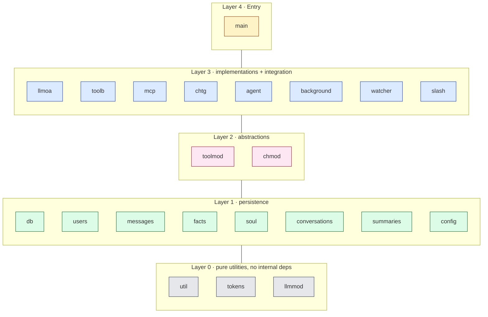

# 04 · Module Dependency Graph

How `src/*.rs` modules import each other. Useful for seeing "if I change X, what might it affect".

## Main dependency graph

```mermaid
flowchart TD
    classDef entry fill:#fef3c7,stroke:#92400e
    classDef channel fill:#dbeafe,stroke:#1e40af
    classDef tool fill:#fce7f3,stroke:#9f1239
    classDef storage fill:#dcfce7,stroke:#166534
    classDef llm fill:#f3e8ff,stroke:#6b21a8
    classDef util fill:#e5e7eb,stroke:#374151

    main[main.rs<br/>CLI dispatch + bootstrap + run_chat/serve]:::entry
    slash[slash.rs<br/>REPL slash commands + role gate]:::entry
    agent[agent.rs<br/>AgentCore + run_turn + TurnState +<br/>build_system_prompt + DEFAULT_BASE_PROMPT]:::entry

    config[config.rs<br/>Config / LlmConfig / AgentConfig / ChannelsConfig]:::util
    background[background.rs<br/>periodic compressor task]:::entry
    watcher[watcher.rs<br/>folkbot.toml mtime poll → base_prompt swap]:::entry

    db[db.rs<br/>SqlitePool + migrations + now_ts + test_pool]:::storage
    users[users.rs<br/>Principal/User/UserRole +<br/>password_hash · argon2id]:::storage
    messages[messages.rs<br/>append/load/clear · DM + room +<br/>load_personal_timeline]:::storage
    facts[facts.rs<br/>Fact/Importance + dedup add]:::storage
    summaries[summaries.rs<br/>day/week/month/quarter +<br/>cascade_rollup + refresh_user_vibe]:::storage
    soul[soul.rs<br/>SoulCard + apply_patch · BEGIN IMMEDIATE]:::storage
    conversations[conversations.rs<br/>rooms + conv_members + labels_for]:::storage

    llmmod[llm/mod.rs<br/>LlmProvider trait + Message/Role/Stream]:::llm
    llmoa[llm/openai.rs<br/>OpenAiCompatProvider · SSE +<br/>connect/idle timeouts]:::llm

    toolmod[tool/mod.rs<br/>Tool trait + ToolRegistry + ToolContext]:::tool
    toolb[tool/builtin.rs<br/>IdentifyUser · FactRemember/Forget ·<br/>SoulPatch · CrossUserTranscript ·<br/>SendMessage]:::tool
    mcp[mcp/mod.rs<br/>JSON-RPC client + McpTool wrapper]:::tool

    chmod[channels/mod.rs<br/>OutboundChannel trait]:::channel
    chtg[channels/telegram.rs<br/>inbound + addressing gate +<br/>cached_soul_triggers + outbound]:::channel

    util[util.rs<br/>fmt_ts · fmt_date · tz_offset OnceLock]:::util
    tokens[tokens.rs<br/>tiktoken cl100k_base + char fallback]:::util

    %% main pulls in everything
    main --> agent
    main --> slash
    main --> background
    main --> watcher
    main --> config
    main --> db
    main --> users
    main --> messages
    main --> facts
    main --> summaries
    main --> soul
    main --> chmod
    main --> chtg
    main --> toolmod
    main --> toolb
    main --> mcp
    main --> util
    main --> llmmod

    slash --> users

    agent --> facts
    agent --> messages
    agent --> soul
    agent --> summaries
    agent --> tokens
    agent --> users
    agent --> conversations
    agent --> chmod
    agent --> toolmod
    agent --> llmmod
    agent --> util
    agent --> db

    background --> users
    background --> messages
    background --> summaries
    background --> llmmod

    watcher --> config
    watcher --> agent

    config --> llmmod
    config --> mcp
    config --> util

    summaries --> users
    summaries --> messages
    summaries --> conversations
    summaries --> llmmod
    summaries --> util
    summaries --> db

    messages --> db
    messages --> llmmod

    soul --> db

    facts --> db

    users --> db

    conversations --> users
    conversations --> db

    toolb --> facts
    toolb --> messages
    toolb --> soul
    toolb --> users
    toolb --> conversations
    toolb --> chmod
    toolb --> llmmod
    toolb --> toolmod
    toolb --> util
    toolb --> db

    toolmod --> users
    toolmod --> chmod
    toolmod --> llmmod

    mcp --> toolmod
    mcp --> llmmod

    chtg --> agent
    chtg --> chmod
    chtg --> users
    chtg --> messages
    chtg --> conversations
    chtg --> soul
    chtg --> llmmod
    chtg --> config

    llmoa --> llmmod
```

---

## Dependency layers (bottom-up)

---

## "If I change X, which callers are hit" lookup

| Change file | Directly impacted callers |
|---|---|
| `db.rs` (schema) | all storage (users/messages/facts/soul/summaries/conversations) |
| `users.rs` (Principal/User shape) | agent / channels/telegram / slash / tool/builtin / messages / summaries |
| `llm/mod.rs` (Message/StreamChunk shape) | llm/openai · agent · summaries · main |
| `tool/mod.rs` (Tool trait) | tool/builtin · mcp |
| `agent.rs` (AgentCore / run_turn signature) | main · channels/telegram · slash · watcher |
| `channels/mod.rs` (OutboundChannel trait) | tool/builtin (`SendMessage`) · channels/telegram |
| `config.rs` (Config shape) | main · watcher · summaries (via build_llms) |
| `util.rs` (fmt_ts / tz_offset) | summaries · agent · main · tool/builtin |

---

## No cyclic dependencies

Every arrow points from "upper / more complex" to "lower / simpler". The Rust crate's internal modules form a DAG, which helps with incremental compilation.

The only one that might trip people up: `channels/telegram.rs` and `tool/builtin.rs (SendMessage)` both use the `OutboundChannel` trait — but the trait is defined in `channels/mod.rs`, and both sides reference that, not each other.

---

## Why this shape

- **`agent.rs` doesn't know about channels directly**: a channel passes `Principal` into `run_turn`; the agent doesn't care if it's CLI or Telegram. To add Discord, the agent doesn't change.
- **`tool/builtin.rs` and `mcp/mod.rs` both implement the same `Tool` trait**: the schema the LLM sees is consistent, and the dispatch path is consistent. The agent doesn't care whether a tool is in-process or child-process.
- **`config.rs` is pure data**: every component pulls config from here, but config doesn't know about any component (other than trait references). That keeps hot-reload simple.
- **`util.rs` / `tokens.rs` are leaves**: pure functions, stateless (apart from `tz_offset` OnceLock), safe to import anywhere without worrying about cycles.
