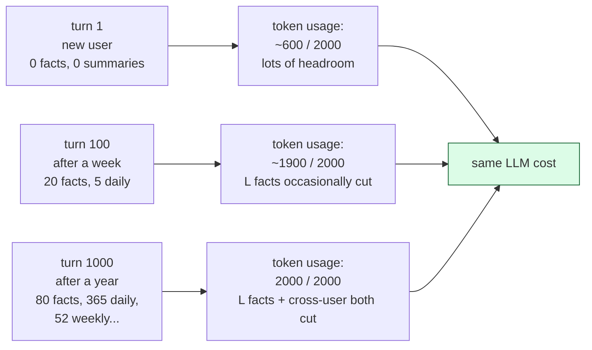
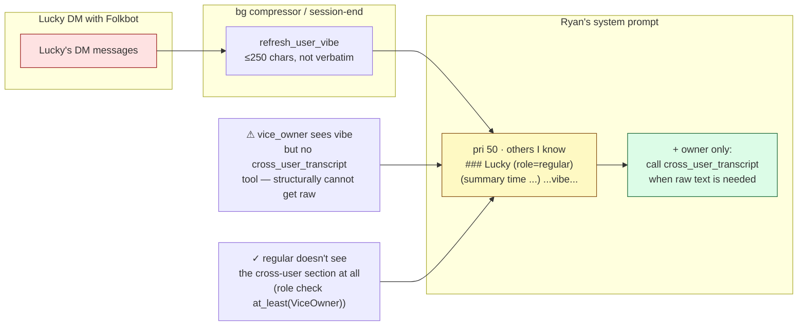

# 05 · Context Pyramid — how the System Prompt is assembled

The system prompt is rebuilt every turn. **Goal**: pack the most important info for Folkbot into a fixed token budget (default 2000). **Means**: give each section a priority, sort by priority, and drop the lower ones first.

## Three-tier memory pyramid (time dimension)

```mermaid
flowchart TB
    classDef raw fill:#fee2e2,stroke:#991b1b
    classDef mid fill:#fef9c3,stroke:#854d0e
    classDef top fill:#dcfce7,stroke:#166534

    M[messages · raw conversation<br/>per-user sliding window ≤20<br/>personal timeline = own DM + my rooms]:::raw

    subgraph S[summaries · mid-term summaries]
        direction TB
        D[day · auto-generated / yesterday auto-filled]
        W[week ← 7 day]
        Mo[month ← 4 week]
        Q[quarter ← 3 month]
    end
    S:::mid

    F[facts H/M/L · permanent knowledge<br/>per-user + shared]:::top

    M -->|session-end / bg compressor| D
    D -->|cascade rollup| W
    W --> Mo
    Mo --> Q

    M -.->|LLM extracts| F
    D -.->|LLM extracts (future)| F
```

**Properties**:
- The higher up, the higher the token / message density
- The lower down, the more likely to be budget-cut
- Each user has their own pyramid
- `users.last_summary` is a special "rolling vibe" for cross-user use (not in the pyramid, but fed into other users' prompts)

---

## Per-turn system prompt assembly flow

```mermaid
flowchart TB
    classDef hard fill:#fef3c7,stroke:#92400e
    classDef soft fill:#dbeafe,stroke:#1e40af
    classDef drop fill:#fee2e2,stroke:#991b1b

    Start([run_turn iter start]) --> Load[TurnState::load<br/>already contains soul / users / facts / summaries / room]

    Load --> P100["pri 100 · base prompt<br/>folkbot.toml [agent].system_prompt<br/>(hot-reload via watcher)"]:::hard
    P100 --> P99["pri 99 · soul card<br/>name / kind / tone / traits / people / quirks<br/>/ formative_memories / nicknames"]:::hard
    P99 --> P98["pri 98 · who I'm talking to<br/>+ role permissions (owner/vice/regular)<br/>+ broadcastable group list"]:::hard
    P98 --> P97["pri 97 · current time<br/>db::now_ts → fmt_ts (HK)"]:::hard
    P97 --> P96A{room?}
    P96A -->|yes| P96Y["pri 96 · this conversation space<br/>group member list + public-lobby privacy boundary"]:::hard
    P96A -->|no| P96N["pri 96 · the setting of this reply<br/>DM 1:1 hint + don't leak others' DMs"]:::hard
    P96Y --> P95
    P96N --> P95["pri 95 · how to read the message timeline<br/>explains [time | source] speaker: content format"]:::hard

    P95 --> P90{H facts?}
    P90 -->|yes| P90Y["pri 90 · permanent facts [H]<br/>must not be forgotten"]:::soft
    P90 -->|no| P75
    P90Y --> P75

    P75{M facts?}
    P75 -->|yes| P75Y["pri 75 · mid-term facts [M]"]:::soft
    P75 -->|no| P65
    P75Y --> P65

    P65{daily summaries?}
    P65 -->|yes| P65Y["pri 65 · our recent context<br/>last 5 daily"]:::soft
    P65 -->|no| P50
    P65Y --> P50

    P50{role >= ViceOwner?<br/>+ other users exist?}
    P50 -->|yes| P50Y["pri 50 · others I know<br/>each one's last_summary<br/>(only owner gets cross_user_transcript hint)"]:::soft
    P50 -->|no| P30
    P50Y --> P30

    P30{L facts?}
    P30 -->|yes| P30Y["pri 30 · trivial facts [L]"]:::soft
    P30 -->|no| Sort
    P30Y --> Sort

    Sort[sort sections by priority DESC]
    Sort --> Budget["accumulate · count tokens per section<br/>if pri >= 95 → must include<br/>else if used+cost <= 2000 → include<br/>else → drop"]
    Budget --> Final[concat by priority DESC → composed system prompt]
```



---

## Section priority table

| Priority | Section | Source | Must include? | Drop order |
|---:|---|---|:---:|---|
| 100 | base prompt | `folkbot.toml [agent].system_prompt` | ✅ | — |
| 99 | soul card | `soul_card` row | ✅ | — |
| 98 | who I'm talking to + role permissions | resolved Principal → User | ✅ | — |
| 97 | current time | `now_ts()` | ✅ | — |
| 96 | DM/Room context hint | `RoomCtx` or DM note | ✅ | — |
| 95 | timeline format explanation | static | ✅ | — |
| 90 | `[H]` facts | `facts WHERE imp='H'` | optional | rare |
| 75 | `[M]` facts | `facts WHERE imp='M'` | optional | low |
| 65 | recent daily summaries (≤5) | `summaries period='day'` | optional | low |
| 50 | cross-user awareness | `users.last_summary` of others | optional | medium |
| 30 | `[L]` facts | `facts WHERE imp='L'` | optional | **first** |

**Rule**: `s.priority >= 95 || used + cost <= budget_tokens`. So 95+ is always kept (even if over budget), and the rest get tried in priority order high-to-low. `L` is always sacrificed first.

---

## Why priority + budget, not fixed slots



**Result**: cost ceiling is predictable (per turn ≤ 2000 prompt tokens + ≤ 20 history msgs); it doesn't balloon with usage over time.

---

## What's special about cross-user awareness



**Key point**: cross-user information only flows as "pre-summarized vibe", never as raw text. Owner has an additional tool escape hatch. vice_owner gets summaries, not raw. regular doesn't see that others exist.

---

## Why it's designed this way

- **priority as integer rather than enum**: makes it easy to insert new sections without changing existing order (leaves headroom in 5/10 increments).
- **mandatory sections split into multiple small pieces** (96/95 not merged): the wording for room vs DM contexts differs, so splitting lets them be edited independently.
- **token counting uses tiktoken cl100k_base**: a reasonable approximation for Claude / GPT / Poe-routed models; fallback is char-weighted.
- **`users.last_summary` is not in the summaries table**: it's "the latest face for others to see", a different concept from "self time-summary"; putting it in the users table makes joins easy.
