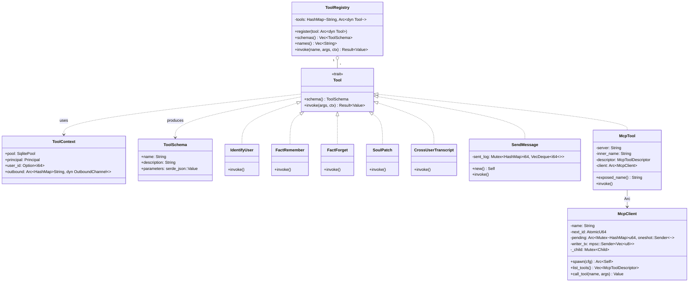
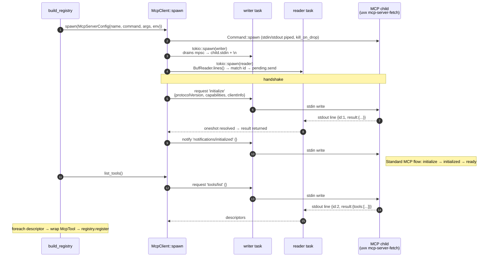
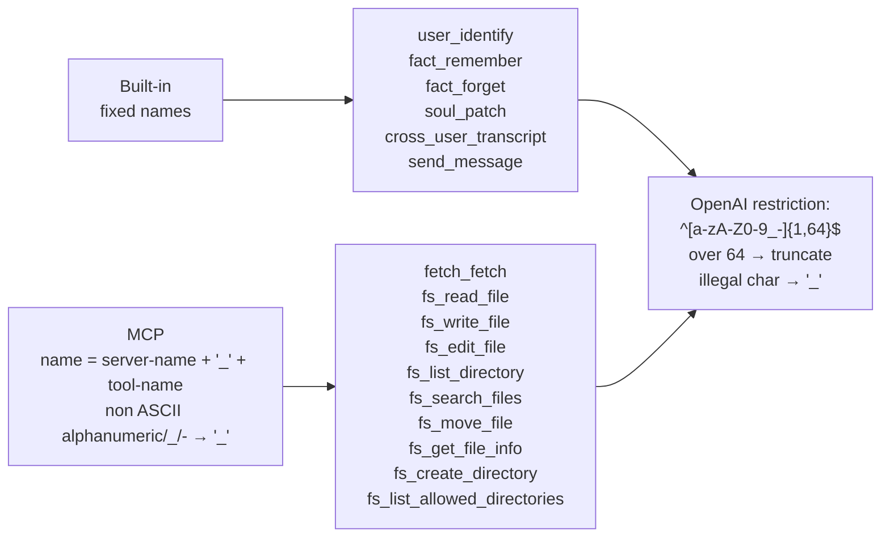
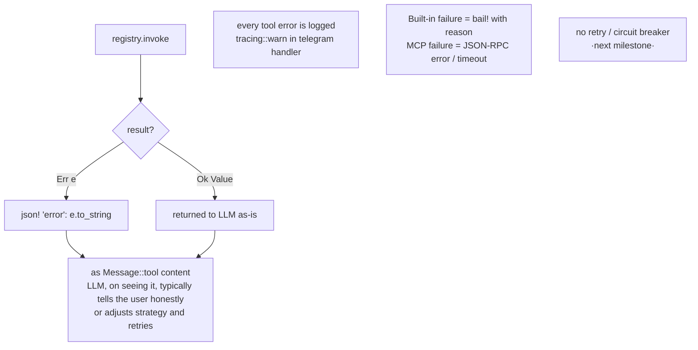

# 07 · Tool System — tool registration, dispatch, MCP integration

The LLM calls tools via the OpenAI tool-call mechanism. Built-in and MCP — the two sources — are unified through one `Tool` trait + `ToolRegistry`.

## Overall class relationships



---

## Built-in vs MCP

```mermaid
flowchart LR
    classDef builtin fill:#fce7f3,stroke:#9f1239
    classDef mcp fill:#dbeafe,stroke:#1e40af
    classDef child fill:#e5e7eb,stroke:#374151

    subgraph In[in-process · Rust]
        IU[IdentifyUser]:::builtin
        FR[FactRemember]:::builtin
        FF[FactForget]:::builtin
        SP[SoulPatch]:::builtin
        CT[CrossUserTranscript]:::builtin
        SM[SendMessage]:::builtin
    end

    subgraph Out[child process · any language]
        FetchT[fetch_fetch]:::mcp
        FsR[fs_read_file]:::mcp
        FsW[fs_write_file]:::mcp
        FsE[fs_edit_file]:::mcp
        FsL[fs_list_directory]:::mcp
        FsM[fs_move_file]:::mcp
        FsS[fs_search_files]:::mcp
        Etc[...]:::mcp
    end

    subgraph Wrap[Rust-side wrapper]
        McpT1[McpTool 'fetch']
        McpT2[McpTool 'fs']
    end

    FetchT --> McpT1
    FsR --> McpT2
    FsW --> McpT2
    FsE --> McpT2
    FsL --> McpT2
    FsM --> McpT2
    FsS --> McpT2
    Etc --> McpT2

    Reg[(ToolRegistry)]
    IU --> Reg
    FR --> Reg
    FF --> Reg
    SP --> Reg
    CT --> Reg
    SM --> Reg
    McpT1 --> Reg
    McpT2 --> Reg

    Reg --> LLM[LLM (via OpenAI tools field)]

    Child1[(uvx mcp-server-fetch<br/>Python)]:::child
    Child2[(npx server-filesystem<br/>Node)]:::child
    McpT1 -.->|JSON-RPC over stdio| Child1
    McpT2 -.->|JSON-RPC over stdio| Child2
```

**To the LLM there's no difference**: both kinds look the same (`name`, `description`, `parameters`). Only the dispatch path differs.

---

## MCP startup handshake



If `initialize` doesn't respond within 30 seconds it times out (`McpClient::request`); startup fails, prints an error, but doesn't kill the whole process.

---

## Tool dispatch details

```mermaid
flowchart TB
    classDef builtin fill:#fce7f3,stroke:#9f1239
    classDef mcp fill:#dbeafe,stroke:#1e40af
    classDef state fill:#fef9c3,stroke:#854d0e

    Start[LLM returns finish_reason=tool_calls<br/>SSE stream ends]
    Start --> Assemble[parse_sse already assembled<br/>Vec_PartialToolCall_ → Vec_ToolCall_]
    Assemble --> Push[push assistant_with_calls into history]
    Push --> ForEach{foreach call · sequential}

    ForEach --> ParseArgs[serde_json::from_str call.function.arguments<br/>→ Value · on failure → empty Object]
    ParseArgs --> EmitStart[on_event TurnEvent::ToolStart]
    EmitStart --> BuildCtx[ToolContext{pool, principal, user_id, outbound}]
    BuildCtx --> Invoke[registry.invoke name args ctx]

    Invoke --> Branch{tool kind?}
    Branch -->|builtin| BuiltDispatch[call .invoke method directly]:::builtin
    Branch -->|McpTool| McpDispatch[McpClient::call_tool name args<br/>· via mpsc → child]:::mcp

    BuiltDispatch --> Result
    McpDispatch --> Result
    Result[Value · or wrapped as 'error']

    Result --> EmitResult[on_event TurnEvent::ToolResult]
    EmitResult --> PushTool[push Message::tool call.id json]
    PushTool --> CheckDirty{call.name in<br/>state-mutating list?}:::state
    CheckDirty -->|yes · user_identify/soul_patch/<br/>fact_remember/fact_forget| Mark[state_dirty = true]
    CheckDirty -->|no| Continue1[continue]

    Mark --> Continue1
    Continue1 --> NextCall{more calls?}
    NextCall -->|yes| ForEach
    NextCall -->|no| AfterLoop

    AfterLoop --> ReloadChk{state_dirty?}
    ReloadChk -->|yes| Reload[TurnState::load again]
    ReloadChk -->|no| Skip[skip reload]

    Reload --> NextIter[continue agent for_loop · iter+1]
    Skip --> NextIter
```

---

## Tool naming rules



Collision avoidance: every MCP tool carries the `<server>_` prefix; built-ins are snake_case verbs — naturally separated.

---

## Failure handling



---

## Why it's designed this way

- **One trait wrapping in-process + child process**: future grpc / wasm / wasi tools only need to implement `Tool`; the agent stays the same.
- **MCP uses stdio JSON-RPC**: that's the MCP standard, and servers can be shared with other clients like Claude Desktop.
- **`SendMessage` carries an in-memory rate limit**: state lives with the tool instance (singleton in the registry); only a restart resets it — sufficient for household use, no need to persist to DB.
- **state_dirty flag**: avoids reloading state for every tool (wasted work) while guaranteeing that the next round after a state-mutating tool is fresh.
- **Tool name prefix + sanitize**: in the future, if an MCP server name contains special characters like `.`, they'll be auto-converted to `_`; no manual mapping required.
