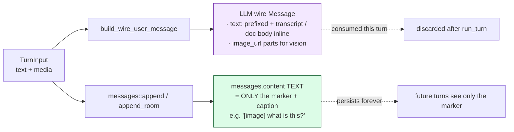
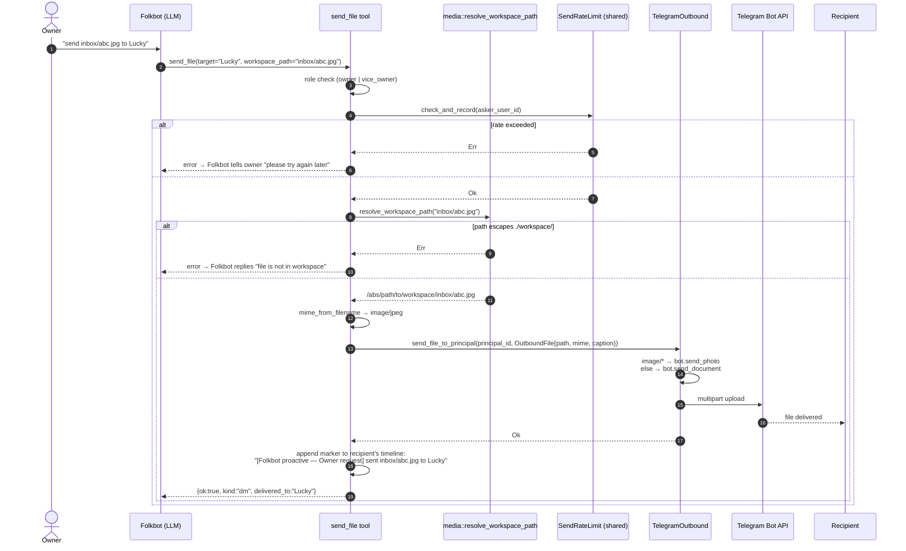
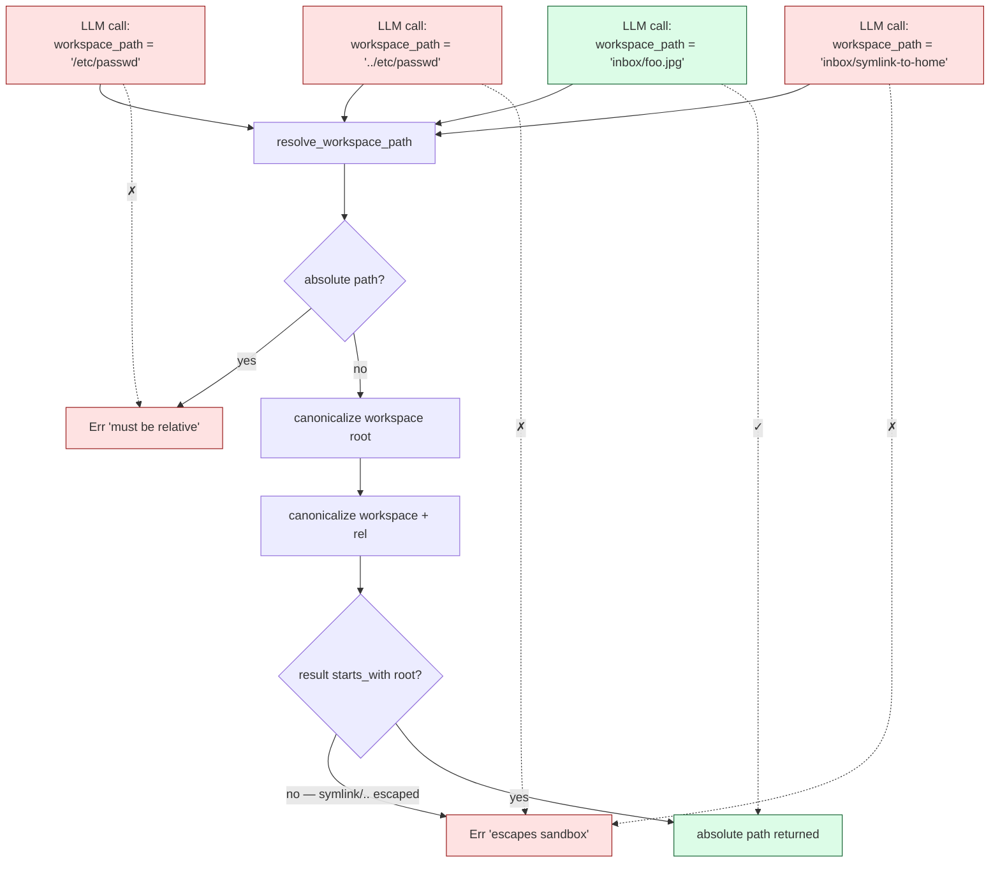
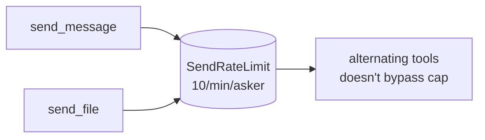

# 08 · Multimodal Ingest (v1.4)

How non-text Telegram messages get into Folkbot's brain. Designed to be cheap
on history (only text markers persist) and graceful on provider gaps
(Whisper missing → fall back, vision unsupported → marker only).

## Inbound classification

```mermaid
flowchart TB
    classDef text fill:#dbeafe,stroke:#1e40af
    classDef img fill:#fce7f3,stroke:#9f1239
    classDef voice fill:#fed7aa,stroke:#9a3412
    classDef doc fill:#dcfce7,stroke:#166534
    classDef note fill:#e5e7eb,stroke:#374151

    M[Telegram Message] --> Disp{content?}

    Disp -->|msg.text| T[plain text]:::text
    T --> TI["TurnInput::text_only(text)"]

    Disp -->|msg.photo| P[take largest PhotoSize]:::img
    P --> Fetch1[get_file → download bytes]
    Fetch1 --> DataUrl1["data: URL (base64)"]
    DataUrl1 --> PI["TurnInput {<br/>  text: '[image] caption?',<br/>  media: [Image]<br/>}"]

    Disp -->|msg.sticker| S{static or animated?}:::img
    S -->|static webp| SS[treat as photo]
    S -->|animated/video| SA["[animated sticker emoji?]<br/>marker only"]
    SS --> PI
    SA --> NI["TurnInput {<br/>  text: marker,<br/>  media: [Note]<br/>}"]

    Disp -->|msg.voice / msg.audio| V[get_file → download bytes]:::voice
    V --> Tr{audio_creds set?}
    Tr -->|yes| WhisperCall[POST /v1/audio/transcriptions]
    WhisperCall --> Tr2{success?}
    Tr2 -->|yes| VT["Voice {transcript: Some(text)}"]
    Tr2 -->|no| VN["Voice {transcript: None}"]
    Tr -->|no| VN
    VT --> VI["TurnInput {<br/>  text: '[voice Ns]',<br/>  media: [Voice with transcript]<br/>}"]
    VN --> VI

    Disp -->|msg.document| D{mime?}:::doc
    D -->|image/*| PD[treat as photo<br/>marker '[image file: name]']
    D -->|text/* or json/yaml/xml + ≤10MB| TD[download bytes → utf8 string]
    D -->|other| ND["[file: name (size · mime)]<br/>marker only"]
    PD --> PI
    TD --> TDI["TurnInput {<br/>  text: marker,<br/>  media: [TextDoc {body}]<br/>}"]
    ND --> NI

    Disp -->|other| Skip[silently ignore<br/>e.g. location, contact]:::note
```

## Persistence vs wire format



**Why this split**: media bytes are expensive to store but cheap to send
once. The marker captures enough context for Folkbot's reply to be informed
(and the reply, which IS persisted, naturally describes what was in the
media). Future turns get the conversational record without the storage
cost.

## Voice transcription path

```mermaid
sequenceDiagram
    autonumber
    participant TG as classify_inbound
    participant Bot as teloxide Bot
    participant CDN as api.telegram.org/file
    participant W as llm/audio.rs · transcribe
    participant Provider as Whisper-compat endpoint
    participant Agent as run_turn

    TG->>Bot: get_file(file_id)
    Bot-->>TG: File{path, ...}
    TG->>CDN: GET /file/bot{TOKEN}/{path}
    CDN-->>TG: bytes (capped 10 MiB)

    alt audio_creds is Some
        TG->>W: transcribe(base, key, model='whisper-1', bytes, mime)
        W->>Provider: POST /audio/transcriptions (multipart)
        alt 200 OK
            Provider-->>W: {"text": "..."}
            W-->>TG: Ok(transcript)
            TG->>Agent: TurnInput {<br/>text: '[voice 5s]',<br/>media: [Voice {transcript: Some}]<br/>}
            Note over Agent: build_wire_user_message inlines<br/>'(voice transcript: ...)'<br/>into the text content part
        else error
            Provider-->>W: 4xx/5xx
            W-->>TG: Err
            TG->>Agent: TurnInput {<br/>text: '[voice 5s]',<br/>media: [Voice {transcript: None}]<br/>}
            Note over Agent: LLM sees only marker;<br/>Folkbot replies "I can't hear voice yet"
        end
    else audio_creds is None
        TG->>Agent: same as transcript=None branch
    end
```

## Size + cost considerations

| Resource | Limit | Where |
|---|---|---|
| Per-file download | 10 MiB | `media::MAX_INBOUND_BYTES` |
| Telegram getFile API | 20 MiB | hard limit (provider-side) |
| Voice/audio mime accepted by Whisper | flac mp3 mp4 mpeg mpga m4a ogg wav webm | OpenAI spec |
| Vision images recognized | jpeg png gif webp bmp heic | `media::is_vision_image` |
| Inlineable text mimes | text/* + json/yaml/xml | `media::is_inlineable_text` |
| Image data URL overhead | ~+33% from base64 | unavoidable |

**Token cost note**: an image counts as ~85–765 tokens depending on
provider + resolution. The 2000-token system-prompt budget is unaffected
(images live in user-message content, not system prompt), but the wire
request total can balloon. Caller-side throttling is the user's
responsibility right now (no per-turn image cap).

## Failure modes & fallbacks

| Failure | Behavior |
|---|---|
| File >10 MiB | `MediaPart::Note { marker: "[...(download failed)]" }` |
| Telegram CDN HTTP error | same as oversize |
| `audio_creds == None` | Voice marker, no transcript; Folkbot sees `[voice Ns]` |
| Whisper endpoint 404/5xx | Same as no creds — log warn |
| Text doc not UTF-8 | `[...(not UTF-8)]` marker; no body inlined |
| Vision LLM doesn't support image_url | provider returns error → caught in `parse_sse`, surfaced as turn error |
| Animated sticker | marker `[animated sticker emoji?]`, no bytes attempted |
| Unrecognized type (location, contact, video note) | silent ignore (debug log) |

## Outbound files — `send_file` tool



### Sandbox enforcement



### Inbound saved to workspace + marker

When inbound media arrives via `classify_inbound`:
1. Bytes downloaded from Telegram
2. Saved to `./workspace/inbox/<file_unique_id>.<ext>` (idempotent — same content, same name)
3. Marker text persisted: `[image: inbox/abc.jpg] caption?`
4. LLM in future turns sees the marker → knows the path → can `send_file` to forward

This means **owner/vice_owner can forward anything Folkbot has ever received** by referring to the path Folkbot already announced in its own timeline. No separate file_id bookkeeping.

### Rate limit shared with `send_message`



## Where in the code

| Piece | file:line |
|---|---|
| `MediaPart` enum + helpers | `src/media.rs` |
| Workspace sandbox + inbox save | `src/media.rs::resolve_workspace_path / save_to_inbox` |
| `TurnInput` struct | `src/agent.rs` (top of `run_turn` impl) |
| Telegram classification | `src/channels/telegram.rs::classify_inbound` |
| Wire message composition | `src/agent.rs::build_wire_user_message` |
| Whisper call | `src/llm/audio.rs::transcribe` |
| Audio creds storage | `src/agent.rs::AudioCreds` (on `AgentCore`) |
| Audio creds bootstrap | `src/main.rs::bootstrap` |
| `OutboundFile` + `send_file_to_*` | `src/channels/mod.rs` (trait), `channels/telegram.rs` (impl) |
| `SendFile` tool | `src/tool/builtin.rs::SendFile` |
| Shared rate limit | `src/tool/builtin.rs::SendRateLimit` |

## Why this shape

- **Single `TurnInput` struct** instead of overloading `&str` lets future
  channels (Discord, web UI) feed media too without changing `run_turn`.
- **Marker = persisted text** keeps DB byte-light; media is regenerable
  upstream (user can resend) and the conversational record (Folkbot's reply)
  preserves what mattered.
- **Voice transcription as best-effort, not required**: Poe-via-OpenAI may
  or may not surface Whisper. Defaulting to opt-in would force every user
  to figure out their provider's audio support; defaulting to try-and-log
  means it just works on providers that have it.
- **Sticker bifurcation by static/animated**: static is just a webp image —
  giving it to a vision LLM works fine and is free. Animated requires
  decoding TGS/WebM, which is a heavyweight dep we don't want.
- **Image documents treated as photos**: people often paste screenshots as
  documents (no compression). Recognizing `image/*` mime + sending as
  vision keeps that natural.
